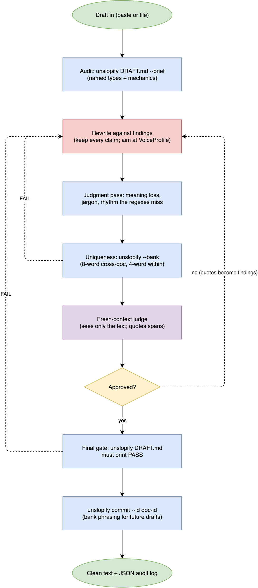
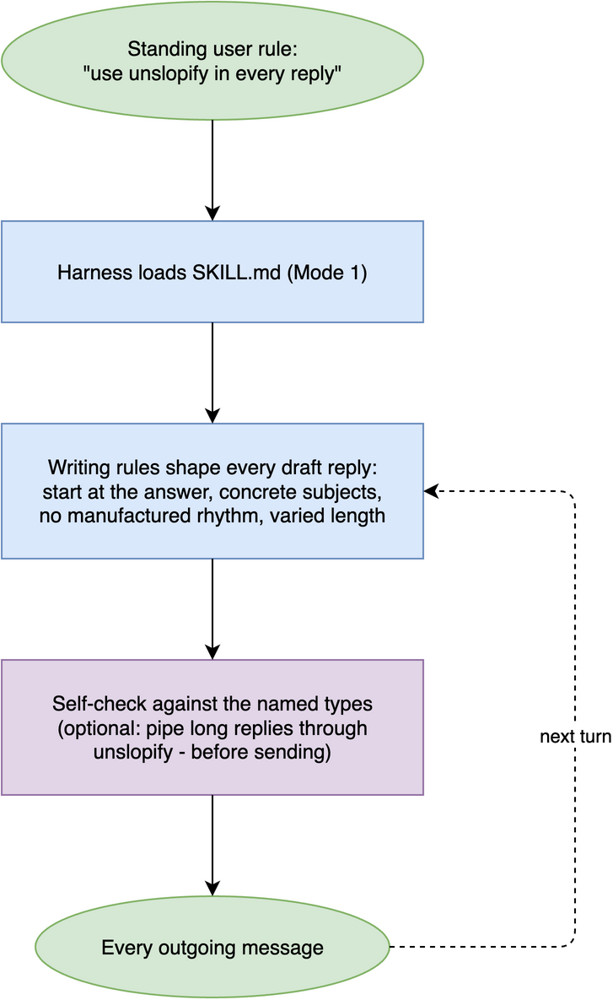

# unslopify

Audit and rewrite text to remove AI-writing patterns. A deterministic
Python core finds the named failures. An agent skill runs the rewrite
loop until a fresh-context judge cannot tell a model touched the text.

## Install

```
pip install unslopify
```

## 30 seconds

```
$ unslopify draft.md
draft.md:1: [scene-setting] "In today's fast-paced digital world"
    A weather-report opener about today's fast-moving world before the actual topic.
draft.md:1: [inflated-contrast] "is not just"
    A plain statement dressed up as a reveal by denying a smaller version of itself first.

FAIL draft.md: 2 findings, 0 mechanics, 0 bank
```

Before:

```text
In today's fast-paced digital world, this release is not just an
update. It is a testament to our team's unwavering commitment,
ensuring a seamless experience for every user.
```

After:

```text
This release fixes the checkout crash and cuts page load from 3 s
to 1 s. Both changes came out of the June incident review.
```

## What it checks

Four categories of named types. `unslopify types` prints all of them
with definitions and examples.

- formula: manufactured rhythm. Inflated contrast, negative
  parallelism, slogan fragments, stock triads, fake authority, canned
  conclusions, AI vocabulary clusters, significance inflation.
- substance: claims a reader cannot verify. Empty abstraction,
  tacked-on benefits, process instead of reason, unsupported claims.
- wording: buried points. Bureaucratic phrasing, hedge stacks,
  unexplained jargon, copula avoidance, overlong sentences.
- structure: packaging that delays the point. Scene-setting,
  request restatement, meta-announcements, redundant conclusions,
  over-structure.

Types are contextual signals with severities and thresholds, not a
banned-word list. Mechanical checks run alongside: em and en dashes,
curly quotes, sentence length, semicolon density, and 4-word phrases
repeated inside one document.

## CLI

```
unslopify DRAFT.md              # audit; exit 0 pass, 1 findings
unslopify - < draft.txt         # audit stdin
unslopify DRAFT.md --json       # full report as JSON
unslopify DRAFT.md --brief      # rewrite instructions for a model or human
unslopify DRAFT.md --fix        # apply safe mechanical fixes only
unslopify DRAFT.md --bank       # also check the cross-document phrase bank
unslopify commit DRAFT.md --id blog-2026-08   # bank a finished document
unslopify types                 # print the rubric
```

The phrase bank lives at `~/.unslopify/phrase_bank.jsonl` (override with
`UNSLOPIFY_HOME`). Committing a finished document banks its 8-word
phrases, and future drafts that reuse any of them fail the `--bank` check.
This is what stops a writer, or an agent, from developing stamps.

## Agent skill

[SKILL.md](SKILL.md) turns any harness that supports skills into the
full rewrite loop: audit, rewrite against named findings, judgment pass,
uniqueness gate, fresh-context judge, final PASS. It also defines an
always-on mode that applies the writing rules to every reply.

Install:

- Any agent with the skills CLI: `npx skills add youngfreezy/unslopify`.
- Claude Code: copy `SKILL.md` into `~/.claude/skills/unslopify/`,
  then invoke with `/unslopify`.
- Cursor: paste the rules from SKILL.md Mode 1 into a project or
  user rule, and use the CLI in the terminal for audits.
- Codex / other: include SKILL.md in the system context and expose
  the `unslopify` CLI.

Using it once installed:

- `/unslopify` followed by pasted text, or by a file path, runs the
  rewrite pipeline on that draft and returns the clean text plus a
  short log of findings fixed and the judge's verdict.
- "use unslopify in every reply" turns on always-on mode for the
  session: the agent writes under the skill's rules from then on. Put
  that sentence in a standing rule to make it permanent.
- The agent shells out to this package's CLI for the audit and the
  phrase bank, so `pip install unslopify` makes the gates real instead
  of self-graded.

## Library

```python
from unslopify import audit_text, build_brief, profile_from_sample

report = audit_text(open("draft.md").read(), source="draft.md")
print(report.verdict, report.counts_by_category)
print(build_brief(report))          # instructions for the rewrite pass
voice = profile_from_sample(open("my_writing.md").read())
```

All models are Pydantic v2. `report.model_dump_json()` gives a stable,
versioned record of every audit, which is also the hook for analytics
in hosted deployments.

## Pipeline



The always-on mode is simpler: a standing rule loads the skill, and the
skill's writing rules apply to every outgoing message.



## Design notes

- The audit is deterministic. Same text in, same report out, no model
  calls, no network. Judgment-only types (meaning loss, jargon the
  regexes miss) are the agent's job and are marked as such in the rubric.
- Edits are events, not vibes. The mechanical pass records every change
  as a typed RewriteEvent (line, rule id, before, after) under a
  StylePolicy. The skill has the agent log its own edits the same way,
  so a finished rewrite ships with the exact record of what moved.
- The judge must be fresh. A model that watched the rewrite approves
  its own choices, so the skill requires a separate context for the final
  read.
- Voice is preserved, not replaced. The optional `VoiceProfile` measures
  the author's sentence lengths, contraction rate, and first-person
  rate, and the rewrite aims at those numbers.

## Calibration on pre-LLM prose

The obvious question for any tool like this: what does it flag in text
written before language models existed? `scripts/calibrate.py` fetches
five public sources (Twain 1883, Darwin 1859, Austen 1813, Doyle 1892,
RFC 7231 from 2014), audits 5,000 words of each, and prints the table.
Run it yourself; the numbers below are from 2026-08-18.

```text
source                                     words  named  mech
Twain, Life on the Mississippi (1883)       5011      1    92
Darwin, On the Origin of Species (1859)     5003      3   206
Austen, Pride and Prejudice (1813)          5002      0   192
Doyle, Adventures of Sherlock Holmes (1892) 5001      2   289
RFC 7231, HTTP/1.1 Semantics (2014)         5004      1   235

named findings per 1,000 words: 0.28 (7 in 25,021)
```

The two columns are different claims and should be read differently.

Named types claim "this is a generated-text pattern", so hits on 1813
prose are false positives. There were 7 in 25,021 words. The script
lists each one: "in order to" three times (Twain, Doyle, the RFC),
two stacked hedges Darwin genuinely wrote, and one true artifact,
Darwin's chapter-contents listing tripping the slogan-fragment shape.
No pre-LLM source hit inflated contrast, fake authority, AI
vocabulary, tacked-on benefits, or scene-setting.

Mechanics are style gates for modern professional writing, not AI
claims. They fire exactly where you would expect: Victorian sentence
lengths, typographic quotes in the Gutenberg files, dashes, and the
RFC's repeated boilerplate (page headers repeat as n-grams). If you
are linting literature rather than a work document, raise
`--max-sentence-words` and read the mechanics column as description,
not verdict.

Further reading on plain technical writing:
[Google developer documentation style guide](https://developers.google.com/style).

## License

MIT.
